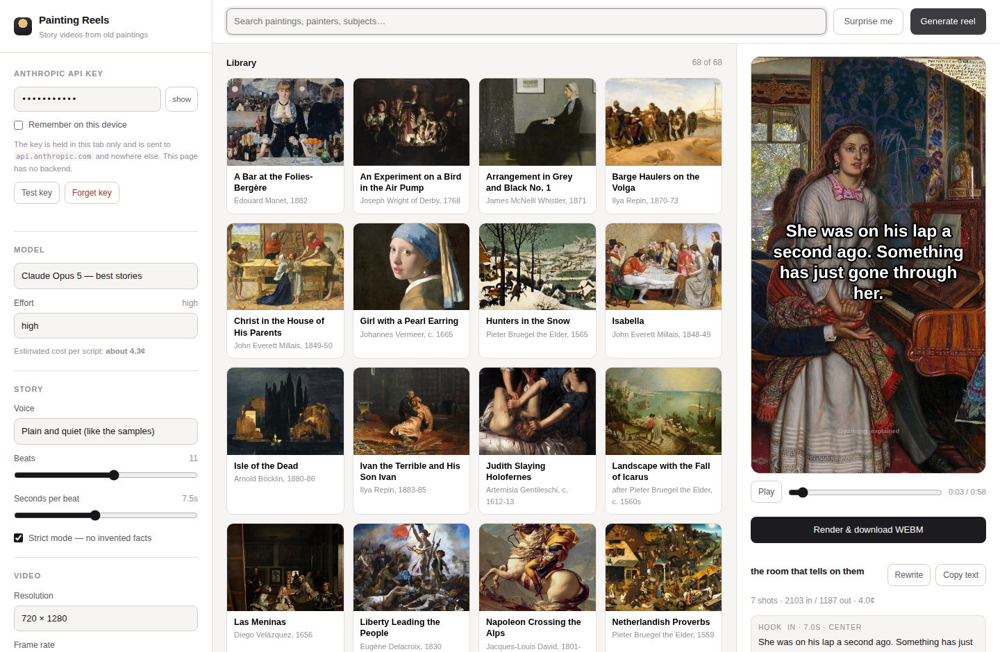

# Painting Reels

A one-page dashboard that turns a public-domain painting into a vertical story
video: pick a painting, press **Generate reel**, watch Claude write the script,
then render an MP4 you can post.

No backend, no build step, no npm install. Your Anthropic API key goes from the
input box straight to `api.anthropic.com` and nowhere else.



## Run it

```sh
git clone https://github.com/mgrugan/painting_reels.git
cd painting_reels
python3 -m http.server 8000     # or: npx http-server -p 8000
```

Then open <http://localhost:8000>. It has to be served over `http://` rather
than opened as a `file://` path, because the app is built from ES modules.

Paste an Anthropic API key into the sidebar ([console.anthropic.com](https://console.anthropic.com/settings/keys)),
pick a painting, press **Generate reel**.

## How a reel is made

1. **Pick a painting.** 68 out-of-copyright works ship in `src/paintings.js`,
   each with the catalogue facts the model is allowed to draw on. You can also
   add your own image from the sidebar.
2. **One API call.** The painting is downscaled to 1000px, JPEG-encoded, and sent
   with its catalogue facts to the Messages API. Claude returns a structured
   script: a hook, a run of detail beats, and a payoff. Each beat carries the
   caption text *and* the region of the painting the camera should be looking at
   while that caption is on screen.
3. **Edit anything.** Every line in the script panel is editable, and the preview
   updates as you type.
4. **Render.** A canvas draws the shots — slow push-ins, pull-backs and drifts
   across each crop, captions burnt in — and `MediaRecorder` captures it to a
   video file. Rendering happens in real time, so a 100-second reel takes 100
   seconds and what you watch is what you get.

The last shot is a title card: the whole painting, its title, artist and
collection. Holding that back until the end is the point of the format.

## Cost

One reel is one API call with one small image, so it is cheap. At the default
11 beats:

| Model | Per reel, effort `high` | Per reel, effort `low` |
|---|---|---|
| Claude Opus 5 | about 11¢ | about 5¢ |
| Claude Sonnet 5 | about 4.5¢ | about 2¢ |
| Claude Haiku 4.5 | under 1¢ | — |

Thinking is on by default on Opus 5 and Sonnet 5 and is billed as output, which
is most of that number — dropping **Effort** to `low` or `medium` is the cheapest
lever before changing model. The sidebar estimate accounts for it; the script
panel shows the real token counts once a script comes back.

Opus 5 is the default because the difference between a good hook and a flat one
is most of the value here. Drop to Haiku for bulk drafting.

## Truth

The whole premise falls apart if the stories are invented, so:

- Each painting in the library carries a `notes` field of documented facts. Those
  notes and the image itself are the only sources the model is given.
- The system prompt forbids inventing dates, names, quotations, prices and
  biographical incidents, and requires scholarly readings to be phrased as
  readings.
- **Strict mode** (on by default) tells the model to cut a beat it cannot justify
  rather than fill the gap.
- Every script comes back with a **grounding** note saying which claims came from
  the catalogue facts and which are description — shown under the script.

Read the grounding line before you post. It is there to be read.

## Video format

The exporter asks for MP4/H.264 first and falls back to WebM/VP9. The button
tells you which one you will get.

Chrome on macOS and Windows, Edge, and Safari all record H.264. Chromium builds
without a proprietary codec licence (most Linux packages) only offer WebM.
Instagram and TikTok want MP4, so on those machines convert after rendering:

```sh
ffmpeg -i reel.webm -c:v libx264 -pix_fmt yuv420p -c:a aac reel.mp4
```

WebM files written by `MediaRecorder` normally carry no duration in their header;
this app splices one in (`src/webm.js`) so editors and upload forms read the
length correctly.

## Your API key

- It lives in a JavaScript variable for the session. **Remember on this device**
  is what puts it in `localStorage`; **Forget key** removes it.
- It is attached to exactly one request, to `https://api.anthropic.com/v1/messages`.
  There is no server in this project to send it to.
- That request carries `anthropic-dangerous-direct-browser-access: true`, which
  is what makes a browser-to-API call possible at all. The trade-off is the usual
  one: anyone who can open this page on this machine can spend the key. Use a key
  you own, and don't host this page somewhere with a key baked in.

## The library

`src/paintings.js` is generated data that is meant to be hand-edited. Each entry:

```js
{
  id: 'the-awakening-conscience-william-holman-hunt',
  title: 'The Awakening Conscience',
  artist: 'William Holman Hunt',
  year: '1853',
  museum: 'Tate Britain, London',
  tags: ['victorian', 'pre-raphaelite', 'morality', 'interior'],
  notes: 'A kept woman rises from the lap of her lover …',   // the model's only source
  src: 'https://thumb.wikimedia.org/…/1280px-….jpg',          // CORS-enabled
  w: 1280, h: 1755,
  page: 'https://en.wikipedia.org/wiki/The_Awakening_Conscience',
}
```

To add one, find the work on Wikimedia Commons, take a `thumb.wikimedia.org`
URL (that host sends `Access-Control-Allow-Origin: *`, which is what lets the
canvas export), and write a short, factual `notes` paragraph. The quality of
`notes` is most of the quality of the script.

Everything shipped is old enough to be out of copyright worldwide. Note that a
painting being public domain does not make every *photograph* of it free in every
jurisdiction; the Wikimedia files used here are ones Commons hosts as
faithful reproductions of two-dimensional public-domain works.

## Files

| File | What it does |
|---|---|
| `index.html`, `styles.css` | The dashboard |
| `src/app.js` | Wiring: settings, library, preview, export |
| `src/paintings.js` | The library and its catalogue facts |
| `src/script.js` | The system prompt and the response schema |
| `src/anthropic.js` | The one API call, pricing, error messages |
| `src/renderer.js` | The camera, the captions, the title card |
| `src/recorder.js` | Canvas + audio → video file |
| `src/webm.js` | Writes a duration into `MediaRecorder` WebM output |
| `src/images.js` | Loading, and the downscaled copy sent to the model |
| `src/store.js` | `localStorage` for settings and the optional key |

## Keyboard

`Space` plays and pauses the preview.
